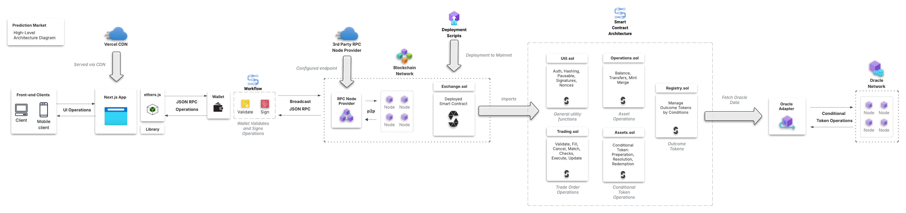

# Prediction Market dApp Example

Prediction market dApp with Solidity smart contracts.

- Predict an outcome of a real-world event 
- Create, find, predict and withdraw markets

## System Design



See `system-design.png` or `system-design.pdf` in root directory for a higher-resolution, more readable version.

**Front-End Tech Stack:**
- 📏 [TypeScript 5.0](https://www.typescriptlang.org/)
- ⚡️ [Next.js 13.2](https://nextjs.org/)
- ⚛️ [React 18.2](https://reactjs.org/)
- 🌬️ [Tailwind CSS 3.3](https://tailwindcss.com/)
- 📕 [Storybook 7.0](https://storybook.js.org/)
- 🧪 [Testing Library](https://testing-library.com/)
- 🃏 [Jest](https://jestjs.io/)
- 🎭 [Playwright](https://playwright.dev/)
- 💡 [Lighthouse](https://developer.chrome.com/docs/lighthouse/)
- 🧹 [ESLint](https://eslint.org/)
- 🤖 [CommitLint](https://commitlint.js.org/)
- 💖 [Prettier](https://prettier.io/)
- 📦 [pnpm](https://pnpm.io/)
- 🏎️ [Turborepo](https://turbo.build/repo)
- 👷 [Github Actions](https://github.com/features/actions)

----

### Apps and Packages

- `apps/website-ssr`: a Next.js app with Tailwind CSS
- `apps/website`: another Next.js app with Tailwind CSS
- `packages/ui`: a stub React component library with Tailwind CSS, shared by both `website-ssr` and `website` apps
- `packages/utils`: utilities shared by both `website-ssr` and `website` apps
- `packages/eslint-config-custom`: shared ESLint configuration
- `packages/jest-config`: shared Jest configuration
- `packages/lighthouse-config`: shared Lighthouse configuration
- `packages/next-config`: shared Next.js configuration
- `packages/playwright-config`: shared Playwright configuration
- `packages/storybook-config`: shared Storybook configuration
- `packages/tailwindcss-config`: shared Tailwind CSS configuration
- `packages/typescript-config`: shared `tsconfig.json` files

## Getting Started

**Run the following command:**

```
git clone https://github.com/Developer-DAO/academy-turbo
cd academy-turbo
pnpm install
```

### Develop Next.js

If you want to start `apps/academy` in development mode, and watch for changes in `packages/ui`, run at the root:

```
pnpm dev --filter academy
```

### Build Next.js

If you want to build `apps/academy` for production, run at the root:

```
pnpm build --filter academy
```

If you want to see an analysis of the generated bundles, specify the `ANALYZE` environment variable:

```
ANALYZE=true pnpm build
```

### Preview Next.js

If you want to preview production builds of `apps/website-ssr` and `apps/website`, run at the root:

```
pnpm start
```

### Develop Storybook

If you want to start all Storybook projects in development mode, run at the root:

```
pnpm storybook:dev
```

### Develop Storybook

If you want to build all Storybook projects, run at the root:

```
pnpm storybook:build
```

### Unit tests

If you want to run unit tests for all projects, run at the root:

```
pnpm test:unit
```

### End-to-end tests

If you want to run e2e tests for all projects, run at the root:

```
pnpm test:e2e
```

### Lint

If you want to run linting for all projects, run at the root:

```
pnpm lint
```

----

# Exchange

## Overview

The `CTFExchange` contract facilitates atomic swaps between binary outcome tokens (ERC1155) and the collateral asset (ERC20). It is intended to be used in a hybrid-decentralized exchange model wherein there is an operator that provides matching/ordering/execution services while settlement happens on-chain,non-custodially according to instructions in the form of signed order messages. The CTF exchange allows for matching operations that include a mint/merge operation which allows orders for complementary outcome tokens to be crossed. Orders are represented as signed typed structured data (EIP712). Additionally, the CTFExchange implements symmetric fees. When orders are matched, one side is considered the maker and the other side is considered the taker. The relationship is always either one to one or many to one (maker to taker) and any price improvement is captured by the taking agent.

## Matching Scenarios

### Assets

* **`A`** - ERC1155 outcome token
* **`A'`** - ERC1155 outcome token, complement of **`A`**.*
* **`C`** - ERC20 collateral token.


*\* Complements assumes 1 outcome token and 1 of its complement can always be merged into 1 unit of collateral and 1 unit of collateral can always be split into 1 outcome token and 1 of its complement (ie **`A`** + **`A'`** = **`C`**). Also assume that outcome tokens and collateral have the same decimals/base unit. Finally, the following examples assume **`C`** is USDC for pricing.*

### Scenario 1 - `NORMAL`

#### Maker Order

- **UserA** BUY **100** token **`A`** @ **$0.50**

*(pseudo variables)*
```json
{
  "maker": "userA",
  "makerAsset": "C",
  "takerAsset": "A",
  "makerAmount": 50,
  "takerAmount": 100
}
```

#### Taker Order

- **UserB** SELL **50** token **`A`** @ **$0.50**

*(pseudo variables)*
```json
{
  "maker": "userB",
  "makerAsset": "A",
  "takerAsset": "C",
  "makerAmount": 50,
  "takerAmount": 25
}
```

#### Match Operation Overview

`matchOrders(makerOrder, [takerOrder], 50, [25])`

1. Transfer **50** token **`A`** from **userB** into `CTFExchange`
2. Transfer **25** **`C`** from **userA** into `CTFExchange`
3. Transfer **50** token **`A`** from `CTFExchange` to **userA**
4. Transfer **25** **`C`** from `CTFExchange` to **userB**

### Scenario 2 - `MINT`

#### Maker Order

- **UserA** BUY **100** token **`A`** @ **$0.50**

*(pseudo variables)*
```json
{
  "maker": "userA",
  "makerAsset": "C",
  "takerAsset": "A",
  "makerAmount": 50,
  "takerAmount": 100
}
```

#### Taker Order

- **UserB** BUY **50** token **`A'`** @ **$0.50**

*(pseudo variables)*
```json
{
  "maker": "userB",
  "makerAsset": "C",
  "takerAsset": "A''",
  "makerAmount": 25,
  "takerAmount": 50
}
```

#### Match Operation Overview

`matchOrders(makerOrder, [takerOrder], 25, 25)`

1. Transfer **25** **`C`** from **userB** into `CTFExchange`
2. Transfer **25** **`C`** from **userA** into `CTFExchange`
3. Mint **50** token sets (= **50** token **`A`** + **50** token **`A'`**)
4. Transfer **50** token **`A`** from `CTFExchange` to **userA**
5. Transfer **50** token **`A'`** from `CTFExchange` to **userB**

## Fees

Fees are levied in the output asset (proceeds). Fees for binary options with a complementary relationship (ie **`A`** + **`A'`** = **`C`**) must be symmetric to preserve market integrity. Symmetric means that someone selling 100 shares of `A` @ $0.99 should pay the same fee value as someone buying 100 `A'` @ $0.01. An intuition for this requires understanding that minting/merging a complementary token set for collateral can happen at any time. Fees are thus implemented in the following manner.

If buying (ie receiving **`A`** or **`A'`**), the fee is levied on the proceed tokens. If selling (ie receiving **`C`**), the fee is levied on the proceed collateral. The base fee rate (`baseFeeRate`) is signed into the order struct. The base fee rate corresponds to 2x the fee rate (collateral per unit of outcome token) paid by traders when the price of the two tokens is equal (ie $0.50 and $0.50). Moving away from a centered price, the following formulas are used to calculate the fees making sure to maintain symmetry.

usdcFee =  baseRate * min(price, 1-price) * outcomeShareCount

**SELL:** If selling outcome tokens (base) for collateral (quote):

$feeQuote =  baseRate * \min(price, 1-price) * size$

**BUY:** If buying outcome tokens (base) with collateral (quote):

$feeBase =  baseRate * \min(price, 1-price) * \frac{size}{price}$

### Fee Examples:

*(assume the full order is filled)*

`baseFeeRate` = 0.02 (usdc/condition)

____

BUY **100** **`A`** @ **$0.50**

`fee` = 2 **`A`**

($1.00 in value)
___

SELL **100** **`A'`** @ **$0.50**

`fee` = 1.0 **`C`**

($1.00 in value)
___

# Exchange

`Exchange` is the core limit order exchange contract
___


## `constructor`

Initializes the abstract contracts it inherits from including `Asset` `Signatures` and `Fees`.

Parameters:

```java
address _collateral // ERC20 collateral asset (USDC)
address _ctf //  ERC1155 outcome tokens contract (gnosis conditional tokens framework)
address _proxyFactory // Polymarket proxy factory
address _safeFactory // Gnosis safe factory contract 
address _feeReceiver // account to accumulate feed to 
```

## `pauseTrading`

Allows admin to pause trading.

Requirements:

- caller is `admin` (`onlyAdmin`)

## `unpauseTrading`

Allows admin to unpause trading.

Requirements:

caller is `admin` (`onlyAdmin`)

## `fillOrder`

Fills the fill amount of an order with `msg.sender` as the taker

Parameters:

```java
Order order // The order to be filled
uint256 fillAmount // The amount to be filled, always in terms of the maker amount
```

Requirements:

- caller is `operator` (`onlyOperator`)
- trading is not `paused` (`notPaused`)
- function is being called for first time in control flow or the previous function call has resolved (`nonReentrant`)


## `fillOrders`

Fills an array of orders for the corresponding fill amounts with `msg.sender` as the taker

Parameters:

```java
Order[] orders // The order to be filled
uint256[] fillAmounts // The amounts to be filled, always in terms of the maker amount
```

Requirements:

- caller is `operator` (`onlyOperator`)
- trading is not `paused` (`notPaused`)
- function is being called for first time in control flow or the previous function call has resolved (`nonReentrant`)

## `matchOrders`

Matches a taker order against an array of maker orders for the specified amounts.

Parameters:

```java
Order takerOrder // The active order to be matched
Order[] makerOrders // The array of maker orders to be matched against the active order
uint256 takerFillAmount // The amount to fill on the taker order, always in terms of the maker amount
uint256[] makerFillAmounts // The array of amounts to fill on the maker orders, always in terms of the maker amount
```

Requirements:

- caller is `operator` (`onlyOperator`)
- trading is not `paused` (`notPaused`)
- function is being called for first time in control flow or the previous function call has resolved (`nonReentrant`)

## `setFeeReceiver`

Sets `feeReceiver` to new address.

Parameters:

```java
address _feeReceiver // The new fee receiver address
```

Requirements:

- caller is `admin` (`onlyAdmin`)


## `setProxyFactory`

Sets `proxyFactory` to new Polymarket proxy wallet factory address.

Parameters:

```java
address _newProxyFactory // The new Proxy Wallet factory
```

Requirements:

- caller is `admin` (`onlyAdmin`)

## `setSafeFactory`

Sets `safeFactory` to new gnosis safe factory address.

Parameters:

```java
address _newSafeFactory // The new Safe wallet factory
```
Requirements:

- caller is `admin` (`onlyAdmin`)


## `registerToken`

Registers a tokenId, its complement and its conditionId for trading.

Parameters:

```java
uint256 token // The ERC1155 (ctf) tokenId being registered
uint256 complement // The ERC1155 (ctf) token ID of the complement of token
bytes32 // The corresponding CTF conditionId
```
Requirements:

- caller is `admin` (`onlyAdmin`)

----

# Trading

Trading implements the core exchange logic for trading CTF assets.

*Note a core assumption that is made is that the collateral and conditional tokens have the same number of decimals. This is true for any CTF token.*

## `getOrderStatus`

Get the status of an order. An order can either be not-filled, partially filled or fully filled. If an order has not been filled, its hash will not exist in the `orderStatus` mapping. If it has been partially filled its hash will exist in this mapping and the maker amount `remaining` will be defined. If the order has been fully filled the hash will exist and the `isCompleted` bool in the `OrderStatus` object will be `true`

Parameters:

```java
bytes32 orderHash // hash of the order
```

Returns:

```java
OrderStatus // status object for the order hash
```

## `validateOrder`

Validates an order. Hashes an order and calls `_validateOrder` with the order hash and order object.

Parameters:

```java
Order order // order to be validated
```

## `cancelOrder`

Cancels an order. Calls `_cancelOrder` with the order. An order can only be cancelled by its maker, the address which holds funds for the order.

Parameters:

```java
Order order // order to be cancelled
```

## `cancelOrders`

Cancels a set of orders by calling `_cancelOrder` on each order is provided order array.

Parameters:

```java
Order[] orders // orders to be cancelled
```

## `_cancelOrder`

Cancels an order by setting its status to completed.

Requirements:

- order's `maker` must be `msg.sender`
- order cannot have already been filled

Parameters:

```java
Order order // order  to cancel
```

Emits:

- `OrderCancelled(orderHash)`

## `_validateOrder`

Validates an order alongside its hash. Reverts if order is not valid.

Requirements:

- order is not expired
- order fee rate is not greater than configured max fee rate
- order signature is valid for order
- order is not already filled
- order has valid nonce

Parameters:

```java
bytes32 orderHash // hash of order to validate
Order order // order object corresponding to orderHash
```

## `_fillOrder`

Fills an order against the caller. First validates the order, then fills it up to the amount specified by `fillAmount`, updates the status and takes calculated fee.

Parameters:

```java
Order order // order to fill
uint256 fillAmount // amount to be filled, always in terms of the maker amount
address to // address to receive proceeds from filling the order
```

Emits:

- `emit OrderFilled(orderHash, msg.sender, order.makerAssetId, order.takerAssetId, making, remaining, fee)`


## `_fillOrders`

Fills a set of orders against the caller by calling `_fillOrders` for each order and corresponding fill amount.

```java
Order[] orders // orders to fill
uint256[] fillAmounts // amounts to be filled for each order in orders, always in terms of the maker amount
address to // address to receive proceeds from filling the orders
```

## `_matchOrders`

Matches a taker order against an array of maker orders up to the amounts specified. Validation is performed to make sure each maker order is able to be filled with the taker order up to the amount specified. The order of transfer operations in the fill is:

1. transfer making amount from taker order to exchange
2. Fill each maker order
    1. Transfer making amount for maker order into exchange
    2. Execute match call (merge or mint)
    3. Transfer taking amount for maker order to the maker order's maker
    4. Fee charged on maker
3. transfer taking amount (calculated based on maker order fills, will include any price improvement for buying) to taker order maker
4. Fee charged on taker
5. transfer any excess making amount left from exchange to taker order maker (price improvement in case of selling)

Requirements:

- all orders valid
- making amounts are valid for each order
- taker order provides enough assets for the filling of all maker orders to the amounts specified
- each maker order is marketable against taker order
- taker gets at least as much proceeds as they expect

Parameters:

```java
Order takerOrder // taker order to be matched
Order[] makerOrders // array of maker orders to be matched against the taker order
uint256 takerFillAmount // amount to fill on the taker order, in terms of the maker amount
uint256[] memory makerFillAmounts // array of amounts to fill on the maker orders, in terms of the maker amount
```

Emits:

- `OrderFilled(orderHash, address(this), takerOrder.makerAssetId, takerOrder.takerAssetId, making, remaining, fee)`
- `OrdersMatched(orderHash, takerOrder.makerAssetId, takerOrder.takerAssetId, making, taking)`

## `_fillMakerOrders`

Fills an array of maker orders for the specified amounts.

Parameters:

```java
Order takerOrder // taker order
Order[] makerOrders // maker orders
uint256[] makerFillAmounts // maker amounts to fill on each maker order
```

## `_fillMakerOrder`

Fills a maker order. In doing so, validates it is marketable with a supplied taker order, derives the pre/post matching operation and charges fees.

Requirements:

- valid taker and maker order
- maker and taker order can be crossed
- amount provided is fillable for maker order

Parameters:

```java
Order takerOrder // taker order object
Order makerOrder // maker order object
uint256 fillAmount // maker amount to be filled on makerOrder
```

Emits:

- `OrderFilled(hashOrder(makerOrder), takerOrder.maker, makerOrder.makerAssetId, makerOrder.takerAssetId, making, remaining, fee)`


## `_validateOrderAndCalcTaking`

Performs common order validation and calculates taking amount for a matched order. The taking amount is proportional to the making amount that is being filled. Additionally the order status is updated to reflect the amount that is being filled.

Requirements:

- Order is valid
- Making amount can be filled on order

Parameters:

```java
Order order // order being validated
uint256 making // maker amount to be filled of order
```

Returns:

```java
uint256 takingAmount // amount of taking amount corresponding to supplied taking amount 
uint256 remainingAmount // maker amount remaining on the order. 
```

## `_fillFacingExchange`

Fills a maker order using the Exchange as the counterparty. Follows the following steps:

1. Transfers makingAmount of maker asset from the order maker to the exchange
2. Executes the match call
    1. In the case a buy + sell is being matching nothing happens
    2. In the case a buy + buy is being matched, a mint (split) happens, since the taker order's collateral is already available and the maker order's collateral was just transferred there should be enough to mint takingAmount.
    3. In the case a sell + sell is being matched a merge happens, since the taker order's conditional tokens will have already been transferred to the exchange and the taker order's conditional tokens were just transferred, there should be enough conditional tokens to merge makingAmount.
3. Transfer taking amount of taker asset to the order maker

Parameters:

```java
uint256 makingAmount // Amount to be filled in terms of maker amount
uint256 takingAmount // Amount to be filled in terms of taker amount
Order order // the order to be filed
MatchType matchType // the match type
```

## `_deriveMatchType`

Provided a taker and maker order determines the matching operation that is needed.

Parameters:

```java
Order takerOrder // the taker order
Order makerOrder // the maker order
```

Returns:

```java
MatchType // type of match NORMAL, MINT or MERGE
```

## `_executeMatchCall`

Executes a CTF call to match orders by minting new Outcome tokens or merging Outcome tokens into collateral.

Parameters:

```java
uint256 makingAmount // Amount to be filled in terms of maker amount, used as amount in merge case
uint256 takingAmount // Amount to be filled in terms of taker amount, used as amount in mint case
Order order // order to be filled
MatchType matchType // the match type
```

## `_validateTakerAndMaker`

Ensures the taker and maker orders can be matched against each other.

Requirements:

- orders are crossing
- in case of NORMAL, conditional tokenIds match across maker and taker order
- in case of MINT, conditional tokenIds should be complementary
- in case of MERGE, conditional tokenIds should be complementary

Parameters:

```java
Order takerOrder // the taker order
Order makerOrder // the maker order
MatchType matchType // the match type
```

## `_chargeFee`

Charges a fee from a payer to the receiver.

Parameters:

```java
address payer // fee payer
address receiver // fee recipient
uint256 tokenId // token id of fee, 0 if collateral
uint256 fee // fee amount
```

Emits:

- `FeeReceived(payer, receiver, tokenId, fee)`

## `_updateOrderStatus`

Updates the order status. Will mark as completed if the making amount plus any already filled amount of order is equal to total order size, otherwise will calculate and store the remaining amount.

Parameters:

```java
bytes32 orderHash // order hash
Order order // order object
uint256 makingAmount // making amount
```

Returns:

```java
uint256 // remaining maker amount for order
```

## `_updateTakingWithSurplus`

Checks to see how much of the tokenId the exchange contract has received and verifies it is greater than the min amount and returns the max(actualAmount, minimumAmount).

Parameters:

```java
uint256 minimumAmount // minimum amount exchange should have of tokenId
uint256 tokenId // tokenId to get balance of
```

Returns:

```java
uint256 // amount of tokenId in contract
```

----

# Asset Operations

Provides balance fetching, transferring and ctf utilities as an abstract contract. Implements both the `IAssetOperations` and `IAssets` interface.

## `_getBalance`

Gets the contract's balance of collateral (`tokenID` == 0) or the contract's balance of the conditional token.

Parameters:

```java
uint256 tokenId // ERC1155 tokenID for ctf, or 0 for getting collateral (ERC20) balance
```

Returns:

```java
uint256 // token balance
```

## `_transfer`

Transfers a quantity of assets, defined by a tokenID, from one address to another address. Calls either `_transferCollateral` or `TransferHelper._transferFromERC1155`.

Parameters:

```java
address from // account from which to transfer assets
address to // account to which to transfer assets
uint256 id // ID of asset to transfer. ERC1155 tokenID for ctf, or 0 for getting collateral (ERC20) balance
uint256 value // amount of asset to transfer
```

## `_transferCollateral`

Called by `_transfer` in the case that `id` == 0. Transfers ERC20 collateral using the `TransferHelper` library which in turn uses either the `transfer` or `transferFrom` ERC20 interface methods. The choice of transfer method depends on whether or not the from address is the contract itself.

Parameters:

```java
address from // account from which to transfer the ERC20 tokens
address to // account to which to transfer the ERC20 tokens
uint256 value // amount of ERC20 tokens to transfer
```

## `_mint`

Mints a full conditional token set from collateral by calling the `splitPostion` function ont he ctf contract with the provided `conditionId`. This will convert X units of collateral (ERC20) into X units of complementary outcome tokens (ERC1155). The zeroed bytes32 is used as the `parentCollectionId` and the partition is the simple binary case [1,2]. You can read more about Gnosis Conditional Tokens [here](https://docs.gnosis.io/conditionaltokens/docs/devguide01/).

Parameters:

```java
bytes32 conditionId // id of condition on which to split
uint256 amount // quantity of collateral to split. Note the collateral and minted conditional tokens will use the same number of decimals.
```


## `_merge`

Opposite of `_mint`. Takes complete sets (equal parts of two complementary outcome tokens) and merges (burns) them by calling the `mergePositions` function on the ctf contract with the provided `conditionId`. Specifically this will convert X complete sets (X of token A (ERC1155) and X of its its complement token A' (ERC1155)) into X units of collateral (ERC20). This function assumes merging happens on a binary set and for the zeroed bytes32 `parentCollectionId`. You can read more about Gnosis Conditional Tokens [here](https://docs.gnosis.io/conditionaltokens/docs/devguide01/).

Parameters:

```java
bytes32 conditionId // id of condition on which to merge
uint256 amount // quantity of complete sets to burn for their underlying collateral.
```

----

# Registry

The `CTFExchange` supports "binary matching". This assumes that two complementary tokens are always worth, in sum, 1 unit of underlying collateral. This is enforced by the CTF contract which always allows minting and merging of full sets (complete collection of outcomes, in our case `A` and its binary complement `A'`). What this ultimately unlocks for the `CTFExchange` is matching between buy orders of `A` and `A'` (via a preceeding "mint" operation), and sell orders of `A` and `A'` (via a succeeding "merge" operation). The `CTFExchange` gets orders to match and is able to determine whether or not a "mint" or "merge" operation is ncessary. The challenge, is that the "mint"/"merge" operation requires knowing the order's base asset's (conditional token) corresponding `conditionId`. Thus, there needs to be a way for the `conditionId` to be gotten from the `tokenId`. The `Registry` is responsible for this function and maintains a mapping of `tokenId`s to `OutcomeToken` objects which include information relating to the specific `tokenId` including the `complement`'s `tokenId`, and the parent `conditionId`. It is the responsibility of operators to register new outcome tokens. Note all methods assume benevolent input by the operator, specifically that they are registering the correct tokenIds/complements/conditions and that they are all binary outcomes that are valid in the context of the CTF contract.


## `getConditionId`

Gets the associated `conditionId` for a `tokenId` by looking it up in the `registry` mapping and returning the `conditionId` value.

Parameters:

```java
uint256 token // token id for which to get conditionId for
```

Returns:

```java
bytes32 // parent conditionId of the token according to the registry
```

## `getComplement`

Gets the complementary `tokenId` for a specified `tokenId` by looking it up in the `registry` mapping and returning the `complement` value.

Parameters:

```java
uint256 token // token id for which to get complement token id for
```

Returns:

```java
uint256 // complement token id
```

## `validateComplement`

Checks whether the `token` id and `complement` id correspond according to `token`'s value in the `registry` mapping. Reverts if not.

Parameters:

```java
uint256 token // token id for which to check complement
uint256 complement // suspected complement token id of token
```

## `validateTokenId`

Checks whether a valid token id (`!=0`) has been registered. Reverts if not

Parameters:

```java
uint256 tokenId // token id to validate registration for
```

## `validateMatchingTokenIds`

Checks whether the `token0` id and `token1` id are equal if it has been registered. Reverts if not.

Parameters:

```java
uint256 token0 // first token id to compare for equality 
uint256 token1 // second token id to compare for equality
```

## `_registerToken`

Registers complementary token pair.

Parameters:

```java
uint256 token0 // first token id of pair
uint256 token1 // second token id of pair
bytes32 conditionID // cft conditionId for the pair
```

Requirements:

- `token0` and `token1` are not equal
- neither `token0` or `token1` are zero
- neither `token0` or `token` have been registered


Emits:

- `TokenRegistered(token0, token1, conditionId)`
- `TokenRegistered(token1, token0, conditionId)`

